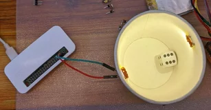
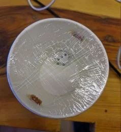
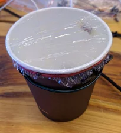
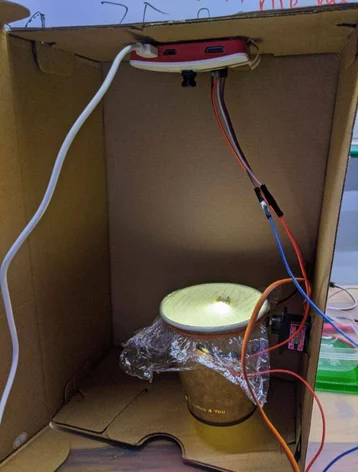

# How to make :mechanic:

If you want to make something like this yourself, here is how!

## Building :building_construction:

The actual machine that rolls the dice is called RollER - Roll **E**xecution **R**untime

I got myself a nice shoebox as a casing and frame for everything. That way, it can be closed, so it's safe to move
around, and from outside light

I glued the Raspberry Pi Zero W at the top, together with a camera

For "the thing where the dice will roll inside", I got myself a white paper cup, so it's a nice **clean** background.
I was heavily inspired by @markfickett's [D20 Roll Fairness project](http://www.markfickett.com/stuff/artPage.php?id=389) - he actually
did *much more* complicated things, you can check it out!

**Inside** the cup, I've put 2 LEDs that will illuminate the dice when pictures are taken. 



Then, wrapped the cup with the clean plastic sandwich foil, so that the dice won't fall off




Thanks to the light source being **inside**, the plastic foil won't give us reflections :+1:

Then I glued it to a servo, and glued the servo to the side of the box - it turned out that it was falling off,
so I had to use the servo's screw :hammer:



That's it! The simpler it is, the more robust it will be :ok_hand:

### Pinout
The default pinout goes like this:
- Servo VCC: 5V (pin 4)
- Servo GND: GND (pin 6)
- Servo signal: GPIO14 (pin8)
- LED light VCC: GPIO4 (pin 7)
- LED light GND: GND (pin 9)

## Backend :computer:

Current Roll-API backend that runs everything together looks like this:

- Python Flask that's serving the API and scheduling jobs to RQ
- RQ worker that shakes the dice and takes pictures of it
- RQ worker that analyzes pictures and counts how many dots are on the dice
- Redis, for RQ
- preferably, a reverse proxy - in my case, that's Caddy

### The actual dice-analyzing

To actually analyze how many dots the dice has, I looked for many solutions, but turned out that with only one dice
and super clean background, I can just use OpenCV's `cv2.SimpleBlobDetector` - it's super fast, and like, 
:100:% accurate :ok_hand:

### Installation :cd:

Currently, there are no fancy Docker containers, or even pip venv - if you want to be super clean and isolate
everything, you can, but since I'm running this on a single Raspberry Pi Zero W (that can't take anything more anyway) 
I just install everything globally

0. Get yourself a Raspberry Pi with a camera, and install RpiOS on it - can be Light version - as
   always, `sudo apt update && sudo apt upgrade`
1. Git clone this, obviously: `git clone https://github.com/TheLastGimbus/Roll-API`
2. Install pip dependencies: `pip3 install -r requirements.txt`
3. Install Redis: `sudo apt install redis-server`
4. Do yourself a favor, ignore all online tutorials, grab a cup of coffee and `sudo apt install python3-opencv`

Great! If I didn't forget anything above, you should have everything required to run!

### Running :rocket:

To run it for debug/development, you can open 3 separate terminals and run: `python3 roll_api.py`, `rq worker images`
and `python3 vision_worker.py`

To run every component of this automatically, I added all of them as systemd services - that way, I can easily restart 
API itself, while workers keep running, and people get their rolls rolled :ok_hand: 
I put all environment variables in `.env_prod` file:
```
ROLL_PRODUCTION=1
FLASK_REVERSE_PROXY=1
```
...and tell all of them to use it. Here are my config files:

`roll-api.service`
```ini
[Unit]
Description=Flask API for Roll-API
After=network.target
Wants=roll-api-image-worker.service
Wants=roll-api-vision-worker.service

[Service]
Type=simple
Restart=always
RestartSec=15
User=pi
EnvironmentFile=/home/pi/Roll-API/.env_prod
WorkingDirectory=/home/pi/Roll-API
ExecStart=/usr/bin/python3 /home/pi/Roll-API/roll_api.py

[Install]
WantedBy=multi-user.target
```

`roll-api-image-worker.service`
```ini
[Unit]
Description=Image worker for Roll-API
Requires=redis.service

[Service]
Type=simple
Restart=always
RestartSec=15
User=pi
EnvironmentFile=/home/pi/Roll-API/.env_prod
WorkingDirectory=/home/pi/Roll-API
ExecStart=/usr/bin/python3 /home/pi/.local/bin/rq worker images --with-scheduler

[Install]
WantedBy=multi-user.target
```

`roll-api-vision-worker.service`
```ini
# Identical as image-worker, except:
ExecStart=/usr/bin/python3 /home/pi/Roll-API/vision_worker.py
```

For a reverse proxy - a server that will manage SSL certificates and do other routing-stuff - I **strongly** recommend
Caddy - it's boy-simple to set up! Here is part of my `Caddyfile` for RollAPI:

```
roll.lastgimbus.com {
  log {
    output file /var/log/caddy/roll.log
    format single_field common_log
    level INFO
  }

  redir /favicon.ico /play/favicon.png

  # This one line is actually the only part that you care about
  reverse_proxy /api* 192.168.1.244:5000

  root * /srv/www/roll.lastgimbus.com/
  file_server /play*
}
```

That's *everything*! It serves the API and also the RollPlay web-app. I actually run it on separate Ubuntu server,
and I recommend you too - this way it can still at least respond with 502, even if I shut down The RollER completely

