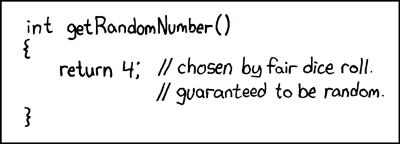
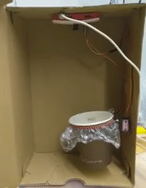
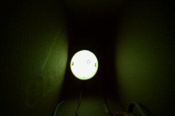

# Roll-API


**R**andom
**O**perator with
**L**arge
**L**atency


This shield ↑ indicates if API is working *right now* 

## What is this?

Did you ever want to get a random number? But like, **really random**



Roll-API is here to help! When you ask it for random number, it shakes the *real, physical dice* :game_die: inside a 
special box, then takes a picture of it :camera:, analyzes how many dots it has :eye:, and gives you the result!



## How to use :monocle_face:

For normies, there is a nice web-app :iphone: written in ~~Flutter~~ HTML+Dart - https://the.lastgimbus.com/rollplay/ -
you can use it on your phone, for example, when playing board games when you can't find a dice :+1:

For terminal people there is a CLI :keyboard: written in Dart - https://github.com/TheLastGimbus/rollapi_dart#cli

### Using the API itself in your code:

Whole API lives under https://roll.lastgimbus.com/api/

(NOTE: All uuid's below are purely example - use your own, that you will get from `roll/`)

1. Make a request to [`roll/`](https://roll.lastgimbus.com/api/roll/):

   ```bash
   $ curl https://roll.lastgimbus.com/api/roll/
   7a1da923-0622-4848-b224-973f1b6c74f0
   ```
   It gives you a UUID of your request - you will use that to check if your roll is ready and what number was drawn

2. Make request to `info/<uuid>/` or `result/<uuid>/`:
   
   - `result/` gives you purely the result - this is useful when making some bash scripts :scroll:
      ```bash
      $ curl https://roll.lastgimbus.com/api/result/7a1da923-0622-4848-b224-973f1b6c74f0/
      6
      ```
      Response text, code:
       - \<number\>, 200 - here is your random number :tada:
       - "QUEUED", 202 - your request is waiting in the queue with other requests - it may take some time :hourglass:
       - "RUNNING", 201 - your request is being rolled right now - wait 5 seconds, and it will be ready :fire:
       - "EXPIRED", 410 - your request has been sitting too long, and it's results don't exist anymore :confused: - make a
         new one :+1:
       - "FAILED", 500 - something failed inside the RollER - maybe dice was moving, idk :shrug: - make a new request, 
         and it should work :+1:
   
   - `info/` gives you a JSON with more info:
      ```bash
      $ curl https://roll.lastgimbus.com/api/info/7a1da923-0622-4848-b224-973f1b6c74f0/
      {
        # Estimated-time-arrival - estimated timestamp when result will be available
        "eta": 1618160853.0,
        # How many requests are before yours in queue
        "queue": 0,  
        # Your result - is null when not finished yet or expired
        "result": 6,  
        # Same statuses as with "result/", except it's "FINISHED" instead of a number
        "status": "FINISHED",  
        # Timestamp when results expire - "-1.0" when waiting in queue, "0.0" when expired or failed
        "ttl": 1618160343.0
      }
      ```
      (`info/` always returns a 200 status code :eyes:)

3. If you are curious how your dice looks - you can request the original image with `image/<uuid>/` :camera:

   ```bash
   $ curl https://roll.lastgimbus.com/api/image/7a1da923-0622-4848-b224-973f1b6c74f0/ > full-image.jpg
   $ ls
   full-image.jpg
   ```

   

   You can also get image from CV analysis (in grayscale, cropped, and with marked detected dots) -
   at `anal-image/<uuid>/`:

   ```bash
   $ curl https://roll.lastgimbus.com/api/anal-image/7a1da923-0622-4848-b224-973f1b6c74f0/ > anal-image.jpg
   $ ls
   anal-image.jpg
   ```

   

   If the request is not finished, it will return same responses as `result/`

### TTL - time to live :coffin:

Your results will be available for 5 minutes when finished. After that, you fill get "EXPIRED" messages, and you need to
make a new request.

## How to make it yourself :mechanic: !

If you want details about how I built it - and how you can do it too - look at [DIY.md](DIY.md)

## Honorable mentions

 - My friend [@amMooncake](https://github.com/amMooncake) made this sweet purple-ish icon - you can check his other graphics out: 
   [Instagram](https://dribbble.com/am_mooncake), [Dribble](https://instagram.com/am_mooncake)
 - The RollER machine was heavily inspired by @markfickett's [D20 Roll Fairness project](http://www.markfickett.com/stuff/artPage.php?id=389)
